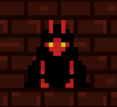
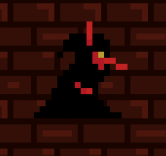
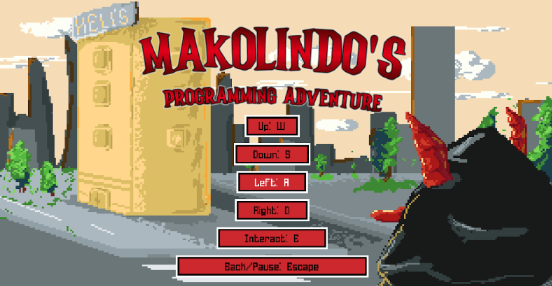

    

<h1 align="center">Makolindo Ascension</h1>

Uma aventura pela redenção e a honra!

<table align="center">
    <tr>
        <td><strong>Nome do Estudante</strong></td>
        <td>Nicolas Gustavo Conte</td>
    </tr>
    <tr>
        <td><strong>Curso</strong></td>
        <td>Engenharia de Software</td>
    </tr>
    <tr>
        <td><strong>Data de Entrega</strong></td>
        <td>05/07/2026</td>
    </tr>
</table>

# Resumo

Neste documento, será descorrido o processo de desenvolvimento de um jogo ao estilo _roguelite_, que busca contar a história do personagem místico fictício chamado "Makolindo" e sua busca pela ascensão pós queda, ambientado em um mundo mágico médio. O projeto busca apresentar os aprendizados, desafios, erros e acertos envolvidos ao longo do processo, assim como uma visão do desenvolvimento de jogos dentro do mercado brasileiro e suas perspectivas para o futuro.

## 1. Introdução

No cenário globalizado atual, os jogos digitais transcenderam o status de nicho, alcançando aproximadamente 3,6 bilhões de jogadores em todo o mundo e gerando um faturamento estimado de US$ 188,8 bilhões até setembro de 2025 (NEWZOO, 2025). Makolindo Ascension tem como seu ponto principal, apresentar que por meio do desenvolvimento de um jogo digital, mesmo em um mercado emergente como o brasileiro, é possível adquirir e unificar conhecimentos técnicos, profissionais e artísticos.

A composição do mesmo, será feita por um conjunto de "sistemas base" integrados, baseados em jogos de sucesso do mesmo seguimento, como [*Hero Siege*](https://store.steampowered.com/app/269210/Hero_Siege/), [*Soul Knight*](https://play.google.com/store/apps/details?id=com.ChillyRoom.DungeonShooter&hl=pt_BR) e [*Undermine*](https://store.steampowered.com/agecheck/app/656350/). Haverão sistemas de geração de níveis randomizadsos, monetização _in-game_, combate (com inimigos e chefões), itens e poderes especiais, que serão destrinchados no decorrer deste documento.

O jogo será desenvolvido por meio da plataforma [_GameMaker_](https://gamemaker.io/pt-BR), com o estilo visual em [_pixel art_](https://en.wikipedia.org/wiki/Pixel_art) simples, voltado para computadores _desktop_ Windows e MacOS, com uma dificuldade ligeiramente mais elevada que seus pares. O intuito é fazer com que o jogador fique envolvido com a história, o fazendo simpatizar com Makolindo, suas dificuldades e empecilhos empostos por seus "inimigos" ao longo do trajeto.

Antes de seguir com a explanação do projeto, será introduzido os conceitos necessários para o entendimento do gênero do jogo, estilo artístico e as obras de referência.

### 1.1. Origem e significado do gênero _roguelike_

Para entendermos o significado de _roguelite_, primeiro veremos rapidamente o significado do termo _roguelike_, seu predecessor. O termo "_roguelite_" surgiu por volta de 1993 nos grupos de notícias da Usenet[[1]](#ref-1)[[2]](#ref-2)[[3]](#ref-3) (plataforma "pré web" de comunicação por texto, com fóruns e notícias), sendo citado pela primeira vez por Andrew Solovay, em uma discussão sobre a criação de um novo fórum específico para discussões sobre jogos como [_Hack_](https://www.nethack.org/), [_Moria_](https://umoria.org/) e [_Rogue_](https://store.steampowered.com/app/1443430/Rogue/). Foi nesta discussão onde definiu-se que o subfórum se chamaria "rec.games.roguelike.*", pois entre todos os jogos, [_Rogue_](https://store.steampowered.com/app/1443430/Rogue/) era considerado o mais antigo entre eles.

<em>Figura 1. Imagem de uma das fases do game <a href="https://store.steampowered.com/app/1443430/Rogue/?l=portuguese">Rogue</a>.</em>

A grande maioria dos _roguelikes_ baseava-se em conceitos de jogos de interpretação de papéis (também conhecidos como RPG's - _Role-play gaming_) como _Dungeon & Dragons_, onde o jogador tem o controle sobre um personagem que pode ser personalizado, escolhendo uma classe, raça e gênero, assim como podendo também ajustar alguns pontos de atributos e habilidades. Porém com o passar dos anos, inúmeros jogos surgiram adotando a nomenclatura de _roguelike_, mas com características distintas aos seus predecessores.

Então em 2008, foi realizado em Berlim, a primeira conferência Internacional de Desenvolvimento de _Roguelike_, onde jogadores e desenvolvedores estabeleceram uma definição para _roguelikes_, conhecida como "Interpretação de Berlim". Essa interpretação definiu um conjunto de fatores de alto e baixo valor, baseando-se em cinco jogos _roguelike_ canônicos (_ADOM_, _Angband_, _Linley's Dungeon Crawl_, _NetHack_ e [_Rogue_](https://store.steampowered.com/app/1443430/Rogue/)), para poder conseguir determinar "o quão _roguelike_ é um jogo". Os tópicos foram definidos como:

- Fatores principais (alto valor):
    - Geração aleatória – os mapas e itens mudam a cada jogo;
    - Morte permanente – morreu, começa tudo de novo;
    - Baseado em turnos – o jogo só anda quando o jogador age;
    - Movimento em grade – o mundo é dividido em blocos (tiles);
    - Sem modos separados – todas as ações (andar, lutar, usar item) seguem o mesmo fluxo;
    - Alta complexidade – muitas opções e estratégias possíveis;
    - Gerenciamento de recursos – o jogador precisa economizar itens, vida, comida etc;
    - Exploração e descoberta – o jogo incentiva explorar e aprender o que cada coisa faz;
- Fatores secundários (baixo valor):
    - Controlar apenas um personagem;
    - Inimigos seguem as mesmas regras do jogador;
    - Combate tático e desafiador;
    - Visual simples ou ASCII (como letras e símbolos);
    - Mapas tipo masmorra, com salas e corredores;
    - Números e estatísticas visíveis (vida, força, dano etc.).

Esses são considerados até hoje, os pontos base para a criação de um "_roguelike_ puro sangue", isso é claro, contendo algumas alterações com base na atualidade.

### 1.2. Origem e significado do gênero _roguelite_

Com a popularização dos _roguelikes_ dentro das comunidades e fóruns online de discussões sobre o gênero[[4]](#ref-4), inúmeros desenvolvedores independentes começaram a desenvolver suas próprias ideias, adicionando novas funcionalidades e conceitos aos jogos. Coincidentemente, no ano de 2008 o qual foi criado a Interpretação de Berlim, houve o lançamento do jogo [_Spelunky_](https://spelunkyworld.com/original.html) (2008), que frequentemente é citado como o primeiro _roguelite_, onde trazia em sua _gameplay_, diversos elementos de um _roguelike_, mas, sem o fator de "morte permanente completa".

Todos os _roguelikes_ que vieram a seguir começaram a implementar algum tipo de progressão permanente, seja com a liberação de atalhos conforme o avanço entre níveis/fases, o acúmulo de algum tipo de moeda, itens, _upgrades_ e etc. Essa "meta-progressão" é a chave central para diferenciação entre ambos gêneros, também podendo afirmar, que os _roguelikes_ viriam ironicamente a ignorar principalmente, os "fatores de alto valor" definidos pela Interpretação de Berlim.

Embora [_Spelunky_](https://spelunkyworld.com/original.html) (2008) e [_The Binding of Isaac_](https://store.steampowered.com/app/113200/The_Binding_of_Isaac/) (2011) sejam considerados os primeiros _roguelites_, até então, a comunidade ainda não havia definido um termo exato para o gênero, frequentemente os chamando de "_roguelike-like_"[[5]](#ref-5). Foi apenas em 2013, com o lançamento do jogo [_Rogue Legacy_](https://store.steampowered.com/app/241600/Rogue_Legacy/) (2013) que o termo foi cunhado, onde os desenvolvedores deixaram claro na descrição do jogo na loja da [_Steam_](https://store.steampowered.com/)[[6]](#ref-6), que embora o seu jogo tivesse elementos de [_Rogue_](https://store.steampowered.com/app/1443430/Rogue/) (geração processual, morte permanente do personagem), o mesmo era para ser "mais leve" - _lite_.

### 1.3. Definição sobre o estilo artístico _pixel art_

A origem do estilo _pixel art_ denota de jogos clássicos como [_Space Invaders_](https://en.wikipedia.org/wiki/Space_Invaders) (1978) e [_Pac-Man_](https://en.wikipedia.org/wiki/Pac-Man) (1980), assim como de videogames da mesma época, onde toda arte visual era focada em poucos grupos de blocos 8-bit. Entretanto, o surgimento do termo "_pixel art_" foi dado em 1982 em uma carta de diário publicada por [Adele Goldberg](https://en.wikipedia.org/wiki/Adele_Goldberg_(computer_scientist)) e Robert Flegal, do centro de pesquisa da Xerox em Palo Alto[[7]](#ref-7):

<em>Figura 2. Pequeno trecho da carta publicada sobre "pixel art".</em>

Na carta, em resumo, era apresentado ao público da época (1982) que "pixel art" era quase todo tipo de representação visual criada/apresentada por um computador (como no exemplo acima, onde um _scan_ de uma foto foi considerado como tal).

## 2. Descrição do Projeto

Makolindo Ascension trata-se de um **jogo digital** ambientado em um universo utópico mágico parecido ao século 16, onde o jogador irá acompanhar a história de "Makolindo", um ser místico com poderes divinos que ajuda todos aqueles que tenham uma alma digna de respeito (que não fazem mal a ninguém, trabalham corretamente e buscam o conhecimento), oferecendo seus **poderes de cura**, **proteção sagrada** e **visão do futuro**.

### 2.1 Tema do Projeto

O jogo será construído ao estilo _roguelite_ (como definido anteriormente) e _dungeon crawler_ — exploração de masmorras — ao estilo _pixel art_ (também definido anteriormente) com foco em 16x16 _bits_. Terá como objetivo principal, contar uma história de superação de desafios relacionados a depressão, traição e desmerecimento, além de, uma _gameplay_ de combate dinâmica voltada a combinação de diversos itens, armas e poderes fixos do Makolindo e uma geração de salas aleatória/procedural.

### 2.2 Propósito e Uso Prático

Como citado anteriormente, o foco será narrar uma história complexa envolvendo a depressão principalmente, onde será apresentado ao jogador os efeitos de um transtorno mental tão grave, seus efeitos no usuário (pessoa afetada) e como pode ser tratada. Vale ressaltar que o jogo não explicará de forma clara e direta que o Makolindo tem tal transtorno mental, nem sequer explicações acadêmicas sobre.

Será tratado de forma visual os efeitos do transtorno, como "demônios" aparecendo em tela, interações do Makolindo com personagens "que não existem" (só ele vê), modo como Makolindo se comporta com outros personagens e falas randômicas do mesmo sobre seus sentimentos. Para concepção e base das ideias sobre como apresentar ao jogador tal transtorno, o livro "Ansiedade: Como enfrentar o mal do século" (2013)[[8]](#ref-8) de [Augusto Cury](https://pt.wikipedia.org/wiki/Augusto_Cury), as experiências do autor diante de dois anos de terapia e da convivência com pessoas próximas com depressão e artigos acadêmicos[[9]](#ref-9)[[10]](#ref-10)[[11]](#ref-11).

O jogador será motivado constantemente a ignorar os sintomas (estimulos visuais) enfrentados por Makolindo, por meio de conversação com demais personagens durante o jogo, ao utilizar os poderes especiais de Makolindo para ajudar NPC's durante a caminhada na masmorra e escolhendo itens com _buffs_ melhores que os demais, e que ajudam Makolindo a lutar contra seu transtorno.

### 2.3 Público-Alvo

Será voltado para amantes de jogos digitais, os quais gostam (ou tem preferência por) de jogos dos gêneros _roguelike_ e/ou _roguelite_, com elementos de _dungeon crawler_, fantasia/magia, "história ativa" e construção de _builds_. A faixa etária ideal está entre 16-30 anos de idade, pois conterá linguagem imprópria (como palavrões) e representações de "sangue" (após causar dano nos inimigos) em determinados momentos do jogo.

### 2.4 Problemas a Resolver

Por se tratar de um jogo digital, o foco não está em resolver qualquer questão específica da industria ou sociedade no geral, por meio da construção de um _software_, como demais projetos. Ainda sim, serão abordados os seguintes pontos:

| **Questão** | **Como Será Tratado?** |
|-------------|------------------------|
| Depressão | Por meio do enredo, elementos visuais e funcionais _in-game_. |
| Geração de Mundo Procedural | Por meio de aleatorização e funções matemáticas, as salas (mundo) serão sempre construídas de forma procedural/aleatória. |
| Combate em Tempo Real | Assim que o jogador entrar em uma sala com inimigos, os mesmos farão todo possível para eliminar o jogador. O jogador poderá desviar dos ataques e deverá evitar sua própria morte, afim de continuar jogando. |

### 2.5 Diferenciação/Ineditismo

Makolindo Ascension busca tratar de forma "lúdica" em alguns aspectos, o funcionamento do transtorno mental conhecido como "Depressão", com expressões visuais e mecânicas _in-game_.

### 2.6 Limitações

Abaixo, veremos todos os sistemas que conterão (sem explicação técnica ainda) com a pontuação de suas limitações:

<table align="center">
    <tr>
        <th>Sistema</th>
        <th>Limitações</th>
    </tr>
    <tr>
        <td>Itens</td>
        <td>
            <ul>
                <li>Serão criados apenas dois itens simples, um com um <i>buff</i> e outro com um <i>debuff</i>;</li>
                <li>Não terão mecânicas complexas que alterem outras funcionalidades do jogo, apenas alterações de <i>status</i> base do jogador.</li>
            </ul>
        </td>
    </tr>
    <tr>
        <td>Armas</td>
        <td>
            <ul>
                <li>Haverá apenas duas armas corpo a corpo e uma à distância;</li>
                <li>Armas não terão habilidades próprias;</li>
                <li>Seus multiplicadores de dano não serão escaláveis.</li>
            </ul>
        </td>
    </tr>
    <tr>
        <td>Habilidades do Jogador</td>
        <td>
            <ul>
                <li>Haverão apenas três habilidades únicas;</li>
                <li>Poderão receber apenas um <i>upgrade</i>;</li>
                <li>Não serão customizáveis.</li>
            </ul>
        </td>
    </tr>
    <tr>
        <td>Inimigos</td>
        <td>
            <ul>
                <li>Existirão apenas três tipos de inimigos: um comum (com pouca vida e dano), um <i>tank</i> (com mais vida e mesma quantidade de dano do comum) e um <i>ranged</i> (a distância);</li>
                <li>Inimigos sempre terão a mesma aparência.</li>
            </ul>
        </td>
    </tr>
    <tr>
        <td>Mecânicas</td>
        <td>
            <ul>
                <li>Não haverá sistema de armadilhas e/ou <i>puzzles</i>;</li>
                <li>Não haverá a loja de itens <i>in-game</i>;</li>
                <li>A câmera sempre ficará seguindo o jogador, mas ficará fixa na sala atual em que o jogador estiver;</li>
                <li>A história será limitada apenas a abrangir os acontecimentos até a queda de Makolindo.</li>
            </ul>
        </td>
    </tr>
</table>

### 2.7 Normas e Legislações Aplicáveis

Serão listadas algumas normas e legislações relevantes ao contexto do jogo, e como podem vir a afetar o seu desenvolvimento.

#### 2.7.1 ESRB

A _Entertainment Software Rating Board_ — ESRB — é uma organização independente que analisa, decide e coloca classificações etárias indicativas para jogos eletrônicos comercializados na América do Norte[[12]](#ref-12). Realizam uma validação do jogo com um sistema próprio de três partes, analisando conteúdos como linguagem, conteúdo sexual, sangue/_gore_, drogas e etc.

Após análise do jogo, o mesmo poderá ser indicado em uma de suas classificações, cada uma com suas limitações quanto aos conteúdos delimitados pelos mesmos. No caso de Makolindo Ascension, o jogo será desenvolvido para se enquadrar na classificação **_Mature 17+_**, que diz o seguinte:

> Content is generally suitable for ages 17 and up. May contain intense violence, blood and gore, sexual content and/or strong language[[13]](#ref-13).

Traduzindo de forma simples, títulos nessa categoria podem conter violência (como agressão física, luta, sangue), procedimentos médicos, jogos de azar simulado, conteúdos com temas sexuais leve como insinuação sexual, nudez velada, consumo de álcool e/ou cigarro e/ou uso de linguagem imprópria. Como citado anteriormente, não necessariamente todos os elementos desta categoria estarão no jogo, mas como será tratado de depressão, podendo haver referências a suicídio, haverá combate com sangue e linguagem imprópria, o mesmo não pode se classificar na classificação anterior _Teen_ (que contém conteúdo bastante moderado quanto aos assuntos citados).

#### 2.7.2 PEGI

A _Pan European Game Information_ — PEGI — é o sistema europeu de classificação de conteúdo de jogos eletrônicos, utilizado em mais de 30 países. Diferente da ESRB, que foca no mercado norte-americano, a PEGI é o padrão para a Europa e utiliza uma combinação de faixas etárias e ícones descritivos de conteúdo para informar os consumidores.

Para Makolindo Ascension, considerando os temas abordados (depressão, violência com sangue, linguagem imprópria), o jogo se enquadraria na classificação **PEGI 16**. Esta classificação é definida da seguinte forma:

> Esta classificação é aplicada quando a representação de violência (ou atividade sexual) atinge um nível que parece igual ao que seria esperado na vida real. O uso de linguagem imprópria em jogos PEGI 16 pode ser mais extremo, assim como o uso de tabaco, álcool ou drogas ilegais[[14]](#ref-14).

Embora o jogo utilize um estilo visual em _pixel art_, o que muitas vezes atenua o impacto visual da violência ("violência não realista"), a presença de temas psicológicos pesados, sangue visível durante o combate e o uso de linguagem chula elevam a classificação para além do PEGI 12. A classificação PEGI 18 seria reservada para violência "gratuita" ou representações muito específicas de violência sexual e uso de drogas, o que não é o foco principal do projeto. Portanto, a faixa de 16 anos é a mais adequada para o público-alvo e o conteúdo proposto.

#### 2.7.3 ClassInd

A Classificação Indicativa (ClassInd) é o sistema brasileiro de classificação de conteúdo, regulamentado pelo Ministério da Justiça e Segurança Pública. Diferente de sistemas como ESRB e PEGI, a ClassInd é uma política pública que visa informar às famílias sobre a adequação de conteúdos audiovisuais e jogos eletrônicos para diferentes faixas etárias, baseando-se na proteção de crianças e adolescentes.

Para Makolindo Ascension, considerando os elementos descritos anteriormente, o jogo se enquadra na classificação **16 anos (Não recomendado para menores de dezesseis anos)**.

De acordo com o Guia Prático da Classificação Indicativa (2025)[[15]](#ref-15), obras classificadas como "16 anos" podem conter:
*   **Violência:** Presença de violência frequente, com produção de sangue ou lesão corporal, ou violência gratuita (sem motivação narrativa forte), desde que não seja de extrema crueldade.
*   **Sexo e Nudez:** Conteúdos que apresentem insinuação sexual ou nudez velada, mas sem cenas de sexo explícito.
*   **Drogas:** Consumo de drogas lícitas ou ilícitas, desde que não haja indução ao uso.
*   **Temas Sensíveis:** Abordagem de temas como suicídio, automutilação ou transtornos mentais com certo grau de impacto ou realismo, exigindo maior maturidade do público.

A classificação "18 anos" seria aplicada apenas se houvesse cenas de sexo explícito, apologia à violência extrema/crueldade ou indução ao uso de drogas, o que excede o escopo do projeto. Portanto, a faixa de 16 anos é a mais adequada para garantir a conformidade com a legislação brasileira e a proteção do público infantojuvenil.

### 2.8 Métricas de Sucesso

Para quantificar o "sucesso" do jogo quanto ao âmbito acadêmico e pessoal do desenvolvedor, serão observados os seguintes pontos:

- **Número de Downloads**: Após completado do MVP do jogo (escopo do RFC apenas), o mesmo será publicado no site gratuíto [itch.io](https://itch.io/) de disponibilização de jogos e conteúdos relacionados, um sucesso para tal projeto será considerado o número de **cem (100) _downloads_**;
- **Avaliações**: No mesmo site citado anteriormente, jogadores podem avaliar o jogo por meio de análises descritivas e pontuação em uma escala de 1 à 5 estrelas, além disso, será levado em conta as avaliações de professores, testadores e "público de fora". Para tal, será considera uma nota base de **3.5 estrelas no mínimo**;
- **Fluidez**: O jogo será testado em diversos sistemas operacionais e em computadores com _hardwares_ distintos, buscando **não encontrar** travamentos nem _crashes_ (corrupção e/ou fechamento imediato do jogo). Para isso, será avaliado uma taxa base de **secenta (60) quadros por segundo** — mais conhecido "FPS" — e **zero _crashes_**. 

## 3. Especificação Técnica

Como já citado brevemente anteriormente, Makolindo Ascension será construído envolto de uma arquitetura de design visual _pixel art_ 16x16 (não limitado apenas a tal definição) ao estilo _roguelite_ e _dungeon crawler_. Nos tópicos a seguir, serão detalhadas as especificações do mesmo.

### 3.1 Requisitos de Software

| **Data** | **Versão** | **Descrição** | **Autor** |
|----------|------------|---------------|-----------|
| 01/12/2025 | 0.1 | Criação do Documento e primeiras definições | Nicolas G. Conte |

#### 3.1.1 Requisitos Funcionais (RF)

- RF01 - O jogo deve permitir alterar opções de volume geral;
- RF02 - O jogador deverá poder escolher quais _upgrades_ permanentes deseja comprar;
- RF03 - O jogador deverá poder escolher comprar os itens da loja ou não;
- RF04 - O jogador deverá poder escolher trocar de arma ou não;
- RF05 - O jogo deve permitir realizar _upgrades_ nas habilidades;
- RF06 - O jogo deve exibir visualmente o dano causado aos inimigos;
- RF07 - Dados do jogo deverão ser salvos de forma criptografada;
- RF08 - O sistema deve gerar as salas do jogo de forma procedural a cada nova partida;
- RF09 - O jogador deve poder movimentar o personagem nas direções cardeais e diagonais;
- RF10 - O jogador deve poder realizar ataques corpo a corpo e à distância, dependendo da arma equipada;
- RF11 - Inimigos devem perseguir e atacar o jogador quando ele entrar na mesma sala;
- RF12 - Ao ter a vida zerada, a partida do jogador deve terminar, e ele deve retornar à área inicial do jogo para iniciar uma nova partida;
- RF13 - O jogo deve apresentar uma interface (HUD) com informações vitais e monetárias do jogador, como vida atual;
- RF14 - O jogador deve poder pausar e despausar o jogo a qualquer momento durante a partida.

#### 3.1.2 Requisitos Não-Funcionais (RNF)

- RNF01 - O jogo será desenvolvido para computadores _desktop_ e _notebooks_ com sistema operacional Windows 11;
- RNF02 - O jogo não dependerá de internet para funcionar;
- RNF03 - A alteração dos dados salvos não deve afetar o funcionamento do jogo;
- RNF04 - O jogo deve manter uma taxa de quadros por segundo (FPS) estável em 60 FPS no hardware alvo;
- RNF05 - A direção de arte do jogo deve seguir um estilo _pixel art_ consistente;
- RNF06 - O tempo de resposta entre o comando do jogador (teclado/mouse) e a ação na tela deve ser mínimo, garantindo a fluidez do combate;
- RNF07 - O jogo deve ser distribuído como um executável único ou por meio de um instalador simples;
- RNF08 - O consumo de recursos de hardware (CPU, RAM) deve ser otimizado para não sobrecarregar sistemas que atendam aos requisitos mínimos.
- RNF09 - O jogador deve poder se mover utilizando as teclas W, A, S e D;
- RNF10 - O jogador deve poder atacar os inimigos clicando com o botão esquerdo do mouse ou tecla do teclado.

### 3.2 Representação dos Requisitos

### 3.3. Aderência aos Requisitos da Linha de Projeto

*   **Jogo jogável do início ao fim:** O projeto define um loop de _gameplay_ completo e funcional. O jogador inicia uma partida, explora salas geradas proceduralmente (RF08), combate inimigos (RF11) e, ao ser derrotado (RF12), retorna à área inicial para adquirir _upgrades_ permanentes (RF02) e começar uma nova tentativa. A seção 2.6 (Limitações) delimita o escopo para garantir que este ciclo seja implementável, constituindo uma "fase ou loop completo funcional";

- **Build funcional distribuída:** O **GameMaker Studio** permite a exportação do projeto como um executável _standalone_ para Windows (RNF01, RNF07). Além disso, a métrica de sucesso (seção 2.8) prevê a publicação do jogo no site `itch.io`, o que pressupõe a existência de uma _build_ funcional e distribuível;

- **Código-fonte acessível:** A utilização do **GitHub** para controle de versão, conforme descrito na seção 3.9, garante que o código-fonte estará organizado e acessível em um repositório, seja ele público ou privado com acesso concedido aos avaliadores;

- **Documentação com foco em game design:** O próprio documento `README.md` serve como a documentação central. Ele detalha a visão geral (seção 2), o objetivo (seção 2.1), o loop de _gameplay_ (implícito nas mecânicas descritas), as mecânicas implementadas (seções 2.6 e 3.1.1) e as tecnologias utilizadas (seção 3.9);

- **Apresentação de elementos mínimos de jogabilidade:** Os requisitos funcionais definem claramente os elementos mínimos:
    - **Personagem controlável:** RF09 (movimentação) e RF10 (ataque);
    - **Regras:** RF11 (comportamento do inimigo) e RF12 (condição de derrota);
    - **Objetivo:** Sobreviver o máximo possível para progredir e fortalecer o personagem entre as partidas;
    - **Vitória/Derrota:** A condição de derrota está explícita em RF12 (vida zerada);

- **Interface minimamente navegável:** O requisito RF13 (apresentação de HUD com informações vitais) e RF14 (pausar o jogo) garantem a presença de uma interface funcional. A menção a menus de _upgrade_ (RF02) e opções (RF01) também cobre a navegabilidade mínima;

- **Arte e som placeholders:** A escolha de ferramentas como **Piskel** e a definição de um estilo _pixel art_ (RNF05) indicam a preocupação com a identidade visual, mesmo que os _assets_ iniciais sejam temporários (_placeholders_) para representar a intenção do design.

### 3.4 Considerações de Design
- **Visão Inicial da Arquitetura**: A arquitetura do jogo será centrada em um modelo de objetos gerenciado por eventos, nativo do GameMaker. Os principais componentes serão:
    - **Objeto Gerenciador Global (`obj_game_manager`):** Um objeto persistente que controlará o estado geral do jogo, como o progresso do jogador entre as partidas (_meta-progressão_), salvamento/carregamento de dados (RF07) e transições entre a área inicial e as masmorras;
    - **Objeto Gerenciador de Nível (`obj_level_manager`):** Responsável pela geração procedural das salas (RF08), posicionamento de inimigos e itens, e controle do fluxo dentro de uma masmorra;
    - **Objeto do Jogador (`obj_player`):** Entidade central que encapsula a lógica de movimentação (RF09), combate (RF10), atributos (vida, dano) e interações com o mundo. Seu comportamento será gerenciado por uma máquina de estados finitos (ex: `idle`, `walk`, `attack`, `dead`).
    - **Objetos de Inimigos (`obj_enemy_parent`):** Um objeto pai definirá o comportamento base dos inimigos (perseguição, ataque - RF11), e objetos filhos herdarão essas características para criar variações (comum, _tank_, _ranged_);
    - **Objeto de Interface (`obj_ui_manager`):** Responsável por desenhar todos os elementos da HUD na tela (RF13), como vida, moedas e informações de itens, além de gerenciar o menu de pausa (RF14).

A interação entre esses componentes será, em sua maioria, orientada a eventos de colisão e eventos de passo (_step events_), que atualizam o estado do jogo a cada quadro.

### 3.5 Padrões de Arquitetura

- **Padrões de Arquitetura**: A arquitetura do GameMaker não se encaixa estritamente em padrões de software tradicionais como MVC ou MVVM. Em vez disso, o projeto adotará os seguintes padrões comuns no desenvolvimento de jogos:
    - **Arquitetura Orientada a Eventos:** O núcleo do GameMaker. A lógica do jogo é acionada por eventos como `Create` (criação de um objeto), `Step` (a cada quadro), `Draw` (desenho na tela) e `Collision`;
    - **Máquina de Estados Finitos (FSM):** Será amplamente utilizada para gerenciar a lógica do jogador e dos inimigos. Cada entidade terá estados distintos (ex: patrulhando, perseguindo, atacando, recuando), o que organiza o código, facilita a depuração e permite a criação de comportamentos complexos de IA;
    - **Padrão Singleton (Gerenciadores):** Objetos como `obj_game_manager` e `obj_level_manager` atuarão como Singletons. Existirá apenas uma instância de cada um por vez, fornecendo um ponto de acesso global para gerenciar sistemas críticos do jogo;
    - **Herança de Objetos:** Para os inimigos, será utilizado o sistema de herança do GameMaker. Um objeto `obj_enemy_parent` conterá a lógica comum a todos os inimigos, e os tipos específicos (`obj_enemy_melee`, `obj_enemy_ranged`) herdarão desse pai, sobrescrevendo ou adicionando comportamentos específicos;
- **Modelos C4**: Devido à natureza monolítica de um executável de jogo, a aplicação do Modelo C4 é limitada. O diagrama de componentes lógicos (nível 2) pode ser representado pela visão de arquitetura descrita na seção 3.4, onde cada "objeto gerenciador" é um componente lógico principal dentro do "container" do jogo.

### 3.6 Mockups Principais

    
    
    
<em>Figura 3-4. Makolindo - Personagem principal.</em>

    
    
<em>Figura 5. Mockup da tela principal do jogo.</em>

### 3.7 Decisões e Alternativas Consideradas
- **Decisões e Alternativas Consideradas**:
    - **Motor de Jogo:**
        - **Escolha:** GameMaker Studio;
        - **Alternativas:** Godot, Unity;
        - **Justificativa:** A simplicidade da linguagem GML e o fluxo de trabalho rápido e orientado a 2D do GameMaker são ideais para um projeto de escopo limitado e focado em mecânicas _roguelite_. Godot seria uma alternativa forte e gratuita, mas a familiaridade prévia com o GameMaker acelera o desenvolvimento. Unity, embora poderoso, tem uma curva de aprendizado mais acentuada e é mais complexo do que o necessário para este projeto;
    - **Geração Procedural:**
        - **Escolha:** Geração baseada em salas pré-definidas conectadas aleatoriamente;
        - **Alternativas:** Algoritmos mais complexos como _Drunkard's Walk_ ou _Cellular Automata_;
        - **Justificativa:** A abordagem de salas pré-definidas permite um maior controle sobre o design de cada sala, garantindo que os desafios de combate e exploração sejam interessantes. A aleatoriedade virá da ordem e do layout em que essas salas são conectadas. Algoritmos mais complexos, embora gerem layouts mais orgânicos, exigiriam mais tempo de desenvolvimento e depuração para garantir a jogabilidade;
    - **Salvamento de Dados:**
        - **Escolha:** Arquivo local com ofuscação (JSON codificado em Base64);
        - **Alternativas:** Texto plano (`.ini`), arquivo binário;
        - **Justificativa:** Salvar em texto plano é inseguro e permite que o jogador manipule facilmente o progresso. Um arquivo binário puro é mais seguro, mas mais difícil de depurar. A abordagem com JSON codificado oferece um bom equilíbrio: é humanamente ilegível para o jogador médio (dificultando a trapaça), mas pode ser facilmente decodificado pelo desenvolvedor para fins de teste e depuração.

### 3.8 Critérios de Escalabilidade, Resiliência e Segurança
- **Critérios de Escalabilidade, Resiliência e Segurança**:
    - **Escalabilidade:** A arquitetura baseada em objetos e herança permite a fácil adição de novos conteúdos. Novos inimigos, itens e armas podem ser criados como novos objetos que herdam de uma base funcional, minimizando a refatoração de código. A geração procedural baseada em salas também é escalável, pois basta adicionar novos _templates_ de salas ao conjunto de possibilidades para aumentar a variedade do jogo;
    - **Resiliência:** Por ser um jogo _offline_, a principal preocupação de resiliência é contra _crashes_ e corrupção de dados de salvamento. O código incluirá verificações para evitar erros comuns (ex: acessar instâncias que não existem). O sistema de salvamento incluirá um _checksum_ ou uma soma de verificação para validar a integridade do arquivo ao ser carregado. Se o arquivo estiver corrompido, o jogo informará o usuário e carregará um estado padrão, em vez de travar;
    - **Segurança:** O foco principal é mitigar a trapaça (_cheating_) local. Conforme descrito na seção 3.10, os dados de salvamento serão ofuscados para dificultar a edição manual. Para a distribuição final, a compilação via YoYo Compiler (YYC) será utilizada para converter o código em C++, tornando a engenharia reversa e a edição de memória em tempo de execução significativamente mais difíceis do que com a máquina virtual padrão.

### 3.9 Stack Tecnológica

<table align="center">
    <tr>
        <th>Categoria</th>
        <th>Escolha</th>
        <th>Justificativa</th>
    </tr>
    <tr>
        <td>Linguagem de Programação</td>
        <td>GML</td>
        <td>A GameMaker Language — GML — é uma linguagem simples de se utilizar e baseada em eventos (<i>Event Driven</i>), o que faz com que junto a sua IDE, ela seja completamente intuitiva, fácil e rápida de se construir sistemas complexos, ao custo de performance, que não fará diferença para este projeto.</td>
    </tr>
    <tr>
        <td>Ferramentas de Desenvolvimento e Gestão</td>
        <td>GameMaker Studio</td>
        <td>
            Plataforma completa de desenvolvimento de jogos de forma gratuita, onde contempla ferramentas de desenvolvimento (código), criação de arte (<i>Pixel Art</i>) e mais. A IDE permite exportação do jogo como um executável para diversas plataformas (Windows, Mac, Linux, Mobile e etc.), também, escolho  pois possuo licença de comercialização do software, me permitindo eventualmente anunciar forma paga.
        </td>
    </tr>
    <tr>
        <td>Ferramentas de Desenvolvimento e Gestão</td>
        <td>Piskel</td>
        <td>
            Para casos onde o GameMaker não supra a necessidade da criação das <i>sprits</i> (artes do jogo) — como em casos mais complexos —, o Piskel será utilizado para tal, pois é uma ferramenta gratuita, simples e mais completa que o GameMaker Studio quanto a criação de arte.
        </td>
    </tr>
    <tr>
        <td>Ferramentas de Desenvolvimento e Gestão</td>
        <td>Visual Studio Code — VScode</td>
        <td>
            IDE de desenvolvimento gratuita mais conhecida e utilizada atualmente, será utilizada única e exclusivamente para criação de documentos no formato <i>Markdown</i> (como este).
        </td>
    </tr>
    <tr>
        <td>Ferramentas de Desenvolvimento e Gestão</td>
        <td>ClickUp</td>
        <td>
            Trata-se de uma ferramenta gratuita <i>online</i>, que engloba inúmeras funções, como quadro de tarefas, quadros brancos e ferramentas de documentação...de forma prática e eficaz. Será utilizado para realizar a prototipação inicial por meio de seu <i>Whiteboard</i> (quadro branco), documentação, criação de <i>sprints</i> e tarefas.
        </td>
    </tr>
    <tr>
        <td>Ferramentas de Desenvolvimento e Gestão</td>
        <td>GitHub</td>
        <td>
            Ferramenta amplamente conhecida por realizar controle de versão código, hospedagem de código, análise de integrações de código (<i>Pull Requests</i>) por meio de IA com o Copilot, Wiki, <i>releases</i>, <i>pipelines</i> e mais. Será utilizado para realizar o controle de versionamento (pois tem integração direta com o GameMaker Studio), análise de <i>Pull Requests</i> com o Copilot, a construção de documentos oficiais com sua Wiki e os lançamentos de versão por meio de sua plataforma de <i>releases</i>.
        </td>
    </tr>
    <tr>
        <td><i>Frameworks</i> e Bibliotecas</td>
        <td>N/A</td>
        <td>N/A</td>
    </tr>
</table>

### 3.10 Considerações de Segurança

Dado que o projeto é um jogo _single-player_ e _offline_, os riscos de segurança são diferentes dos de uma aplicação _web_ ou _mobile_ conectada. O foco se volta para a proteção da integridade do jogo e da experiência do usuário contra manipulações locais.

- **Riscos Identificados**
  - **Manipulação de Save Files:** Jogadores podem tentar editar manualmente os arquivos de salvamento para obter vantagens indevidas, como moedas, itens ou progresso desbloqueado;
  - **Cheating via Memory Editing:** Uso de ferramentas de terceiros (como Cheat Engine) para alterar valores do jogo em tempo de execução (vida, dano, etc.), quebrando a curva de dificuldade e a experiência pretendida;
  - **Engenharia Reversa e Pirataria:** Descompilação do executável do jogo para roubo de _assets_ (arte, música, código) ou para redistribuição não autorizada em canais não oficiais;
- **Medidas de Mitigação**
  - **Ofuscação de Dados de Salvamento:** Os dados de progresso do jogador não serão salvos em formato de texto plano (como `.ini` ou `.txt` simples). Em vez disso, será utilizada uma estrutura de dados (como `ds_map`) que será convertida para uma string JSON e, em seguida, codificada (ex: em Base64) ou criptografada antes de ser salva em um arquivo. Isso dificultará a leitura e edição manual. Um _checksum_ (soma de verificação) será incluído no arquivo de save para validar sua integridade no carregamento;
  - **Compilação Nativa (YYC):** Para as versões de lançamento no Steam e Itch.io, o jogo será compilado usando o YoYo Compiler (YYC) do GameMaker em vez da máquina virtual padrão. O YYC converte o código GML para C++, resultando em um executável nativo que é significativamente mais difícil de descompilar e analisar do que o código interpretado;
  - **Validação de Integridade:** Para futuras funcionalidades _online_ (como placares de líderes), todas as pontuações enviadas ao servidor incluirão um _hash_ de validação gerado a partir de dados da partida, para mitigar o envio de pontuações falsas;
- **Normas e Boas Práticas Seguidas**
  - **LGPD (Lei Geral de Proteção de Dados):** Conforme detalhado na seção 3.5, o jogo em seu escopo atual não coleta dados pessoais. Qualquer funcionalidade futura que envolva dados de usuário seguirá estritamente os princípios da LGPD, com políticas de privacidade claras e consentimento explícito.

### 3.11 Conformidade e Normas Aplicáveis

O projeto será desenvolvido em conformidade com as seguintes regulamentações e normas, garantindo sua adequação legal e ética para distribuição:

- **ClassInd (Classificação Indicativa - Brasil)**
  - **Norma:** Sistema de classificação de conteúdo do Ministério da Justiça e Segurança Pública do Brasil.
  - **Como será atendida:** O jogo será desenvolvido para se enquadrar na classificação **"Não recomendado para menores de 16 anos"**. O conteúdo de violência (com representação de sangue), a linguagem imprópria e a abordagem de temas sensíveis como depressão serão mantidos em um nível que não exceda os limites definidos pelo Guia Prático da Classificação Indicativa para esta faixa etária, evitando violência de crueldade extrema ou apologia a drogas.

- **ESRB (_Entertainment Software Rating Board_ - América do Norte)**
  - **Norma:** Sistema de classificação etária para jogos eletrônicos na América do Norte.
  - **Como será atendida:** O projeto almeja a classificação **"Mature 17+"**. Para isso, o conteúdo de violência, sangue e linguagem será desenvolvido de acordo com as diretrizes da ESRB para essa categoria, garantindo que os descritores de conteúdo sejam aplicados corretamente.

- **PEGI (_Pan European Game Information_ - Europa)**
  - **Norma:** Sistema europeu de classificação de conteúdo de jogos.
  - **Como será atendida:** O jogo buscará a classificação **"PEGI 16"**. A representação da violência, embora em _pixel art_, juntamente com o uso de linguagem imprópria e a complexidade dos temas psicológicos, justifica esta classificação. O desenvolvimento seguirá as diretrizes da PEGI para garantir que o conteúdo se mantenha adequado para maiores de 16 anos.

- **Lei de Direitos Autorais (Lei nº 9.610/98 - Brasil e equivalentes internacionais)**
  - **Norma:** Legislação que protege a propriedade intelectual de obras criativas.
  - **Como será atendida:** Todos os _assets_ (arte, música, sons) e códigos utilizados no projeto serão de autoria própria ou obtidos de fontes que permitam o uso comercial e/ou não comercial, como bibliotecas com licenças permissivas (Creative Commons, MIT). As referências a obras externas serão devidamente creditadas, como já iniciado na seção de referências do documento.

- **LGPD (Lei Geral de Proteção de Dados - Lei nº 13.709/2018)**
  - **Norma:** Legislação brasileira que regula o tratamento de dados pessoais.
  - **Como será atendida:** O escopo atual do projeto não prevê a coleta de dados pessoais dos jogadores. O jogo será uma experiência offline. Caso futuras versões incluam funcionalidades online (como placares ou contas de usuário), serão implementadas políticas de privacidade claras, solicitando o consentimento do usuário e garantindo que apenas os dados estritamente necessários sejam coletados e armazenados de forma segura.
   
## 4. Próximos Passos

 - Descrição dos passos seguintes após a conclusão do documento, com uma visão geral do cronograma para Portfólio I e II.
 - Definição de Marcos: Estabelecer datas para entregas intermediárias e checkpoints.

## 5. Referências

1. <a id="ref-1">WIKIPÉDIA.</a> <i>Roguelike</i>. Wikipédia, a enciclopédia livre, 2025. Disponível em: [https://pt.wikipedia.org/wiki/Roguelike](https://pt.wikipedia.org/wiki/Roguelike). Acesso em: 07 out. 2025.
2. <a id="ref-2">ZAPATA,</a> Santiago. <i>On the Historical Origin of the “Roguelike” Term</i>. Slashie’s Gamedev Adventures, v. 1.2.1, 13 nov. 2017. Disponível em: [https://blog.slashie.net/on-the-historical-origin-of-the-roguelike-term/](https://blog.slashie.net/on-the-historical-origin-of-the-roguelike-term/). Acesso em: 07 out. 2025.
3. <a id="ref-3">GROUPS GOOGLE.</a> RFD: rec.games.dungeon.* hierarchy. Google Groups, 1993. Disponível em: [https://groups.google.com/g/news.groups/c/CdWOd-M6g-w/m/cgNn2b9uU2sJ](https://groups.google.com/g/news.groups/c/CdWOd-M6g-w/m/cgNn2b9uU2sJ). Acesso em: 07 out. 2025.
4. <a id="ref-4">ROCK PAPER SHOTGUN.</a> O que é um Roguelike?. Disponível em: [https://www.rockpapershotgun.com/what-is-a-roguelike](https://www.rockpapershotgun.com/what-is-a-roguelike). Acesso em: 11 nov. 2025.
5. <a id="ref-5">PENNY-ARCADE.</a> <i>What the hell is a roguelike? We try to hash out a definition</i>. Disponível em: [https://web.archive.org/web/20130607061437/http://penny-arcade.com/report/article/what-the-hell-is-a-roguelike-we-try-to-hash-out-a-definition](https://web.archive.org/web/20130607061437/http://penny-arcade.com/report/article/what-the-hell-is-a-roguelike-we-try-to-hash-out-a-definition). Acesso em: 11 nov. 2025.
6. <a id="ref-6">ROUGE LEGACY.</a> Disponível em: [https://store.steampowered.com/app/241600/Rogue_Legacy/](https://store.steampowered.com/app/241600/Rogue_Legacy/). Acesso em: 11 nov. 2025.
7. <a id="ref-7">GOLDBERG</a> Adele. <i>Pixel Art</i>. Disponível em: https://dl.acm.org/doi/epdf/10.1145/358728.358731. Acesso em: 12 nov. 2025.
8. <a id="ref-8">CURY</a> Augusto. Ansiedade: Como Enfrentar o Mal do Século. Disponível em: [https://www.amazon.com.br/ANSIEDADE-COMO-ENFRENTAR-MAL-S%C3%89CULO-ebook/dp/B0762J55MW/ref=tmm_kin_swatch_0](https://www.amazon.com.br/ANSIEDADE-COMO-ENFRENTAR-MAL-S%C3%89CULO-ebook/dp/B0762J55MW/ref=tmm_kin_swatch_0). Acesso em: 17 nov. 2025.
9. <a id="ref-9">PEREIRA</a>, Lucélia Grace Gonçalves. Depressão, o Mal do Século XXI: Possíveis Diagnósticos e Tratamentos. Repositório Institucional da UFMG. Disponível em: [https://repositorio.ufmg.br/server/api/core/bitstreams/385a02c7-abfe-48e3-9f82-26cebcf601c8/content](https://repositorio.ufmg.br/server/api/core/bitstreams/385a02c7-abfe-48e3-9f82-26cebcf601c8/content). Acesso em: 17 nov. 2025.
10. <a id="ref-10">QUEVEDO</a>, João; NARDI, Antonio Egidio; SILVA, Antônio Geraldo da (Org.). Depressão: Teoria e Clínica. Disponível em: [https://books.google.com.br/books?id=KTVxDwAAQBAJ](https://books.google.com.br/books?id=KTVxDwAAQBAJ). Acesso em: 17 nov. 2025.
11. <a id="ref-11">MAIA</a>, Berta Rodrigues; DIAS, Paulo César. Ansiedade, depressão e estresse em estudantes universitários: o impacto da COVID-19. Psicologia: Teoria e Pesquisa, 2020. Disponível em: [http://dx.doi.org/10.1590/1982-0275202037e200067](http://dx.doi.org/10.1590/1982-0275202037e200067). Acesso em: 17 nov. 2025.
12. <a id="ref-12">ESRB</a>. <i>About ESRB</i>, 2025. Disponível em: [https://www.esrb.org/about/](https://www.esrb.org/about/). Acesso em: 25 nov. 2025.
13. <a id="ref-13">ESRB</a>. <i>Ratings Guide</i>, 2025. Disponível em: [https://www.esrb.org/ratings-guide/](https://www.esrb.org/ratings-guide/). Acesso em: 25 nov. 2025.
14. <a id="ref-14">PEGI</a>. <i>PEGI 16</i>, 2025. Disponível em: [https://pegi.info/pt-pt/pegi-16](https://pegi.info/pt-pt/pegi-16). Acesso em: 25 nov. 2025.
15. <a id="ref-15">CLASSIND</a>. Guia Prático de Audiovisual, RPG e aplicativos - 2025, 2025. Disponível em: [https://www.gov.br/mj/pt-br/assuntos/seus-direitos/classificacao-1/classind-audio-visual-2025-vs-10-nova-faixa.pdf/view](https://www.gov.br/mj/pt-br/assuntos/seus-direitos/classificacao-1/classind-audio-visual-2025-vs-10-nova-faixa.pdf/view). Acesso em: 25 nov. 2025.

- OPEN GAME ART. [S. l.: s. n.], [s. d.]. Disponível em: [https://opengameart.org/](https://opengameart.org/). Acesso em: 15 set. 2025.
- BEEPBOX. [S. l.: s. n.], [s. d.]. Disponível em: [https://www.beepbox.co/](https://www.beepbox.co/). Acesso em: 15 set. 2025.
- ROGuelike vs. Roguelite: você sabe quais são as diferenças?. **TecMundo**, 28 maio 2022. Disponível em: [https://www.tecmundo.com.br/voxel/237827-roguelike-vs-roguelite-voce-sabe-diferencas.htm](https://www.tecmundo.com.br/voxel/237827-roguelike-vs-roguelite-voce-sabe-diferencas.htm). Acesso em: 15 set. 2025.
- BERLIN Interpretation. In: ROGUEBASIN. [S. l.], 2021. Disponível em: [https://www.roguebasin.com/index.php/Berlin_Interpretation](https://www.roguebasin.com/index.php/Berlin_Interpretation). Acesso em: 15 set. 2025.
- CAMPOS, Amanda Rodrigues. **Zombieland: Desenvolvimento de um jogo de gênero Roguelite** 2023. Trabalho de Conclusão de Curso (Graduação em Tecnologia em Jogos Digitais) - Faculdade de Tecnologia de Americana (Fatec), São Paulo, 2023. Disponível em: [http://ric-cps.eastus2.cloudapp.azure.com/bitstream/123456789/15548/3/20232S_Amanda%20Campos_OD1833.pdf](http://ric-cps.eastus2.cloudapp.azure.com/bitstream/123456789/15548/3/20232S_Amanda%20Campos_OD1833.pdf). Acesso em: 15 set. 2025.
- MARTIN, Geoffrey. Roguelike vs. Roguelite: What's The Difference?. **TheGamer**, 23 ago. 2023. Disponível em: [https://www.thegamer.com/roguelike-vs-roguelite-what-the-difference/](https://www.thegamer.com/roguelike-vs-roguelite-what-the-difference/). Acesso em: 15 set. 2025.
- MAKOLINDO MONSTRO. **A Jornada de um DEPRESSIVO a um MONSTRO (INSPIRADOR)** - Motivação. [S. l.]: YouTube, 28 jan. 2023. Disponível em: [https://www.youtube.com/watch?v=PZUaRZJJNhg](https://www.youtube.com/watch?v=PZUaRZJJNhg). Acesso em: 15 set. 2025.
- MARCOS GAMEDEV. **PARE de usar a GODOT do JEITO ERRADO!**. [S. l.]: YouTube, 24 mar. 2024. Disponível em: [https://www.youtube.com/watch?v=xV6guE1Khuk](https://www.youtube.com/watch?v=xV6guE1Khuk). Acesso em: 15 set. 2025.
- MAKOLINDO MONSTRO. [S. l.]: YouTube, [s. d.]. Canal. Disponível em: [https://www.youtube.com/@MakolindoMonstro/videos](https://www.youtube.com/@MakolindoMonstro/videos). Acesso em: 15 set. 2025.
- GAME MAKER'S TOOLKIT. [S. l.]: YouTube, [s. d.]. Canal. Disponível em: [https://www.youtube.com/@GMTK/videos](https://www.youtube.com/@GMTK/videos). Acesso em: 15 set. 2025.
- MARCOS GAMEDEV. **Como foi criar o meu próprio Motor de Jogo?**. [S. l.]: YouTube, 21 out. 2023. Disponível em: [https://www.youtube.com/watch?v=opBd-Oa6wMk](https://www.youtube.com/watch?v=opBd-Oa6wMk). Acesso em: 15 set. 2025.
- MGYS - MAKE GAME YOURSELF. [S. l.: s. n.], [s. d.]. Planilha Google. Disponível em: [https://docs.google.com/spreadsheets/d/1Mqcqh9G20bH4nwyVIQn3OIXHdL8gzgyztdC6b8exiQM/edit?gid=88563757#gid=88563757](https://docs.google.com/spreadsheets/d/1Mqcqh9G20bH4nwyVIQn3OIXHdL8gzgyztdC6b8exiQM/edit?gid=88563757#gid=88563757). Acesso em: 15 set. 2025.
- NEWZOO. **Newzoo Global Games Market Report 2025**. [S. l.]: Newzoo, 2025. Disponível em: [https://newzoo.com/resources/trend-reports/newzoo-global-games-market-report-2025](https://newzoo.com/resources/trend-reports/newzoo-global-games-market-report-2025). Acesso em: 15 set. 2025.
- CARTLIDGE. [S. l.: s. n.], [s. d.]. Disponível em: [https://gamestudies.org/2403/articles/cartlidge](https://gamestudies.org/2403/articles/cartlidge). Acesso em: 11 nov. 2025.

## 6. Apêndices (Opcionais)

Informações complementares, dados de suporte ou discussões detalhadas fora do corpo principal.

## 7. Avaliações de Professores

Adicionar três páginas no final do RFC para que os Professores escolhidos possam fazer suas considerações e assinatura:
- Considerações Professor/a:
- Considerações Professor/a:
- Considerações Professor/a: